# project-proactive-team-18
Detect and analyze the Zeus Banking Trojan using various tools and techniques, including malware simulation, network monitoring, memory analysis, and signature-based detection.

# Proactive Security Final Project

Team 18

| Name                     | ID           | role         |
|--------------------------|--------------|------------- |
| Yousef Ahmed Ebrahim Farahat | 20201377622 | Yara      |
| Youssef George Abdou     | 2106148      | Volatilty    |
| Abd El Rahman Raslan     | 20221460102  | Splunk       |
| Ahmed Yasser Battour     | 2106135      | Suricata     |

---

## Contents
1. [Suricata](#suricata)
2. [Splunk](#splunk)
3. [Analyze Memory with Volatility](#analyze-memory-with-volatility)
4. [Yara](#yara)

---

---

## Suricata

First, I created a file called custom-new.rules and added these rules for Suricata running on Windows:

shell
alert ip any any -> 85.114.128.127 any (msg:"Blocked Trojan Communication to IP 192.168.1.124"; sid:100001; rev:1; classtype:trojan-activity; priority:1;)
alert dns any any -> any any (msg:"Blocked DNS query for fpdownload.macromedia.com (Trojan IOC)"; content:"fpdownload.macromedia.com"; nocase; sid:100002; rev:1; classtype:trojan-activity; priority:1;)
alert dns any any -> any any (msg:"Blocked DNS response for Trojan domain resolving to IP 192.168.1.124"; content:"192.168.1.124"; sid:100003; rev:1; classtype:trojan-activity; priority:1;)

Then, I added this file to the rules folder. Next, I edited the yaml file and included custom-new.rules. Finally, I tested Suricata using:

shell
suricata.exe -T -c "C:\Program Files\Suricata\suricata.yaml"

No errors were found, and I started Suricata to monitor.

---

---

## Splunk

### Step 1: Configure Splunk for Log Ingestion

a. Install Splunk Enterprise

	1.Download Splunk Enterprise on your system.
	2.Install and start Splunk by accessing http://localhost:8000.
	3.Log in with the credentials you set during installation.

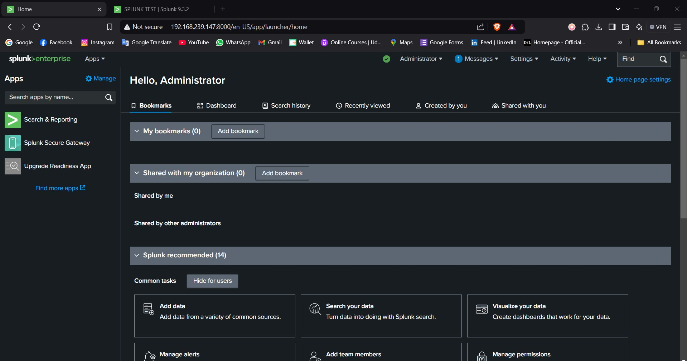

b. Upload Suricata Logs to Splunk

	1.Go to Settings > Add Data.
	2.Select Upload and browse to your Suricata logs (e.g., eve.json and fast.log).
	3.Select the sourcetype as _json for eve.json and custom_suricata for fast.log.
	4.Add tags like MALWARE or Suricata.

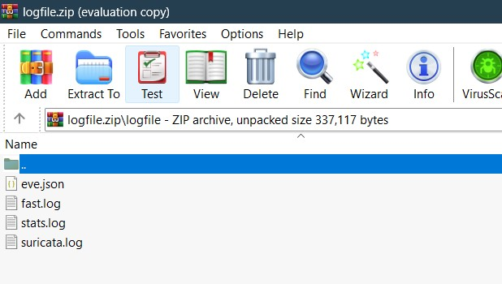

### Step 2: Create Correlation Searches

Splunk correlation searches will help detect and link abnormal traffic with system activity.
a. Detect Abnormal Outbound Traffic

Use this search query:
(source="fast.log" OR source="eve.json") event_type=alert
| stats count by dest_ip src_ip dest_port app_proto
| where count > 100 OR dest_ip IN ("192.168.1.124", "85.114.128.127")
| table src_ip dest_ip dest_port app_proto count
	
Goal: Identify excessive outbound traffic or connections to suspicious IPs.

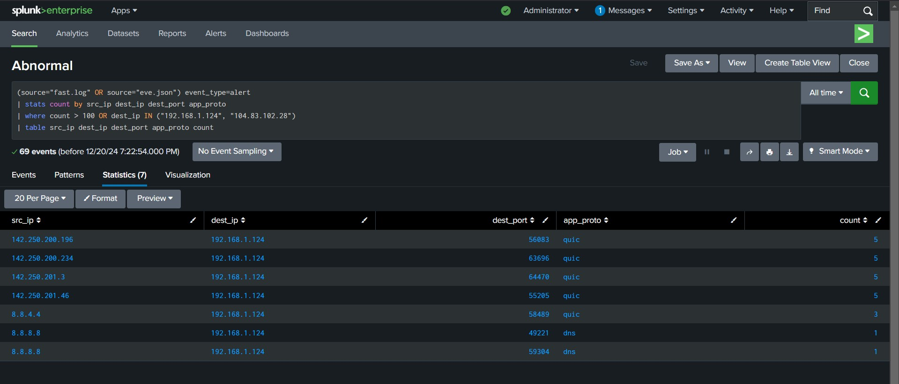

b. Link Network Anomalies with System Activity

If you are ingesting Windows Event Logs (e.g., process creation events):
(source="eve.json" event_type=alert OR index=windows EventCode=4688)
| eval anomaly_type=if(event_type="alert", "Network Alert", "System Event")
| transaction src_ip maxspan=30s
| table _time src_ip dest_ip dest_port event_type anomaly_type Message

Goal: Correlate network alerts with process creation logs to link anomalies.

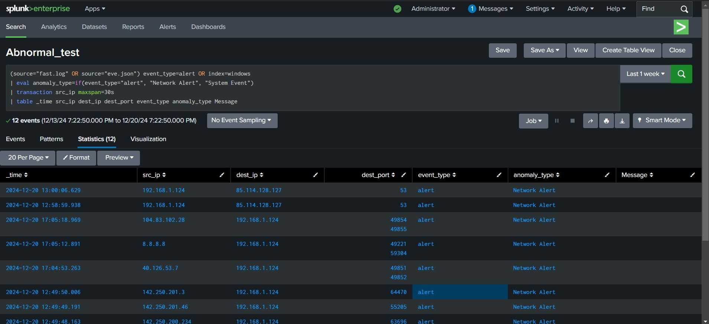

### Step 3: Create Dashboards

a. Dashboard for Abnormal Outbound Traffic

	1.Go to Dashboards > Create New Dashboard.
	2.Name the dashboard "Malware Analysis".
	3.Add a panel with the search query for abnormal outbound traffic.
	4.Visualize the data using a bar chart or table to show:
		o Source IP
		o Destination IP
		o Application Protocol
		o Count of connections.

b. Dashboard for Correlation Analysis

	1.Add a new panel to the same dashboard.
	2.Use the query for linking network anomalies with system activity.
	3.Visualize the data using a timeline or table.

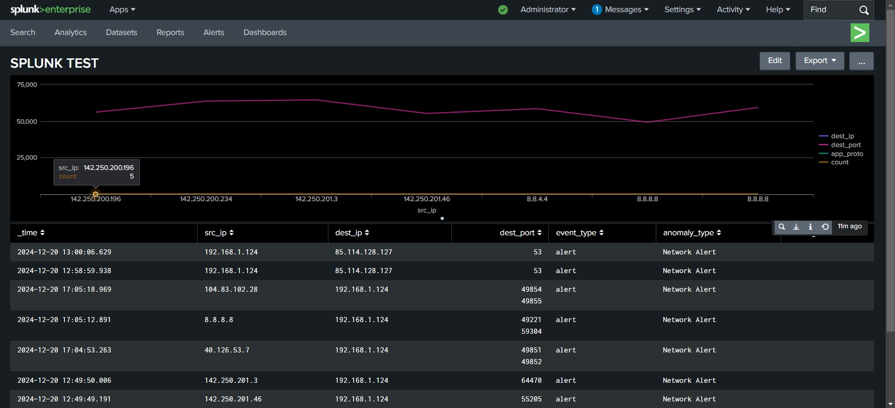

### Step 4: Generate Alerts

Alert for Abnormal Traffic

	1.Go to Settings > Alerts > Create Alert.
	2.Set the alert query:
		(source="fast.log" OR source="eve.json") event_type=alert
		| stats count by dest_ip src_ip dest_port app_proto
		| where count > 100 OR dest_ip IN ("192.168.1.124", "85.114.128.127")

	3.Set the trigger conditions (e.g., if the count exceeds 100).
	4.Notify via email or Slack.

### Step 5: Advanced Correlation Rules

a. Combine Suricata Logs with Threat Intelligence

If you have a threat intelligence feed:
(source="eve.json" event_type=alert) 
| lookup threat_intelligence.csv ip AS dest_ip OUTPUT category threat_level
| where isnotnull(threat_level)
| table _time src_ip dest_ip dest_port category threat_level
z

Goal: Identify whether Suricata alerts match known threats.

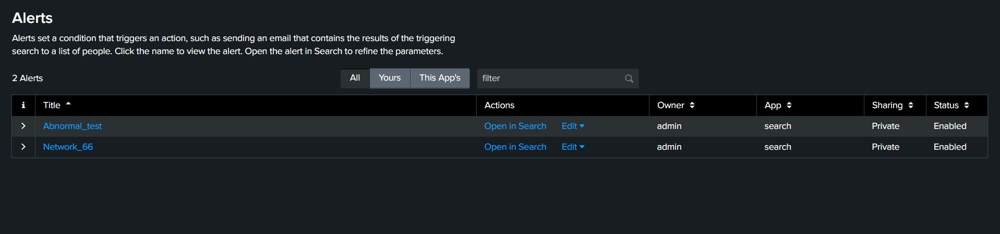

### Step 6: Example Workflow

Scenario

  1.Ingest Logs: Suricata triggers an alert for outbound traffic to 85.114.128.127.
  
  2.Correlation: Splunk detects a linked process creation event with a suspicious command-line argument.
  
  3.Visualization: Dashboards display:
  
  	o Frequent destinations for outbound traffic.
   
  	o Processes correlated with network anomalies.
   
  4.Alerting: Splunk sends an alert when abnormal traffic exceeds a threshold or matches a threat feed.

### Step 7: Additional Suggestions

  •Install Suricata App for Splunk: If available, this app can parse and enrich Suricata logs.
  
  •Use Threat Intelligence Lookups: Add threat intel feeds to correlate alerts with known malicious indicators.

---

## Analyze Memory with Volatility

### Step 1: Identify Profile
We downloaded a memory dump and identified the profile using the imageinfo plugin:

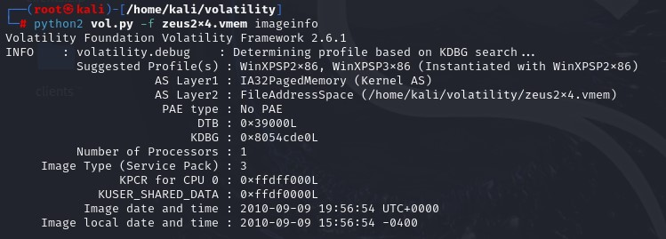

We selected "WinXPSP2x86" from the suggested profiles and continued.

### Step 2: List Processes
We listed processes using the psscan plugin:

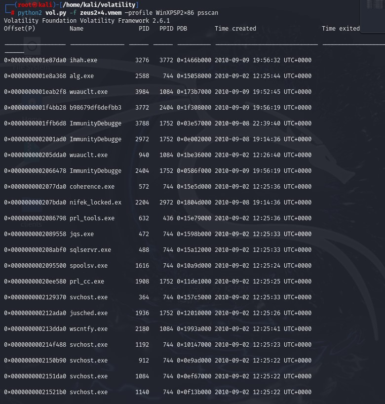
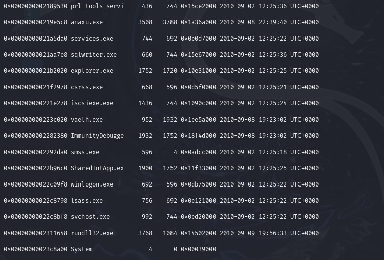

We don’t see anything suspicious from the processes listed

### Step 3: Parent-Child Relationships
We examined parent-child relationships using the pstree plugin:

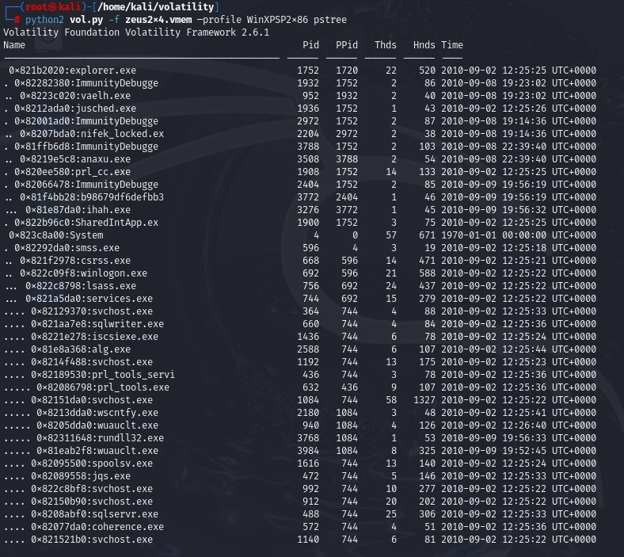

Still, nothing suspicious was found. The names of the processes, their count, and their relationships all appeared legitimate.

### Step 4: Network Connections
Now we will go for looking for suspicious activities is the network connections
There are open connection shown by connections plugin with PID 1752,

shows that there are connections made by the PID 1752 by connscan plugin

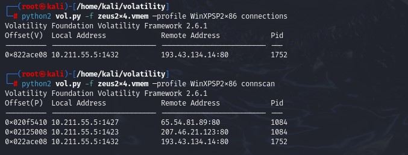

We checked the reputation of IP 193.43.134.14 on VirusTotal, which flagged it as suspicious:

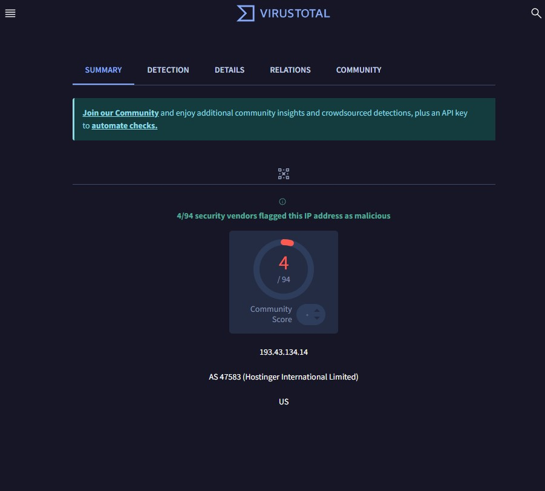
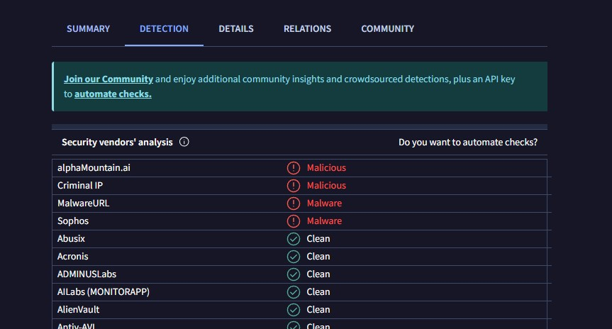

### Step 5: Investigate Processes
Now let’s see which process was communicating with this IP address by grepping the output of psscan.

(images)
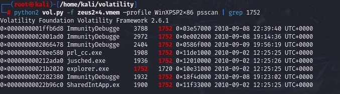
We can see that the process that made the suspicious network connection is “explorer.exe” of PID 1752

Using the cmdline plugin, we confirmed the process path appeared legitimate:

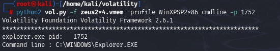

Till now nothing about the process looks suspicious.
Maybe the code is injected into this process.
To investigate this, let’s use malfind plugin.

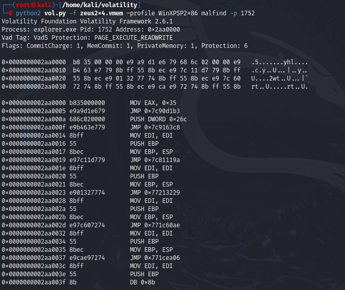
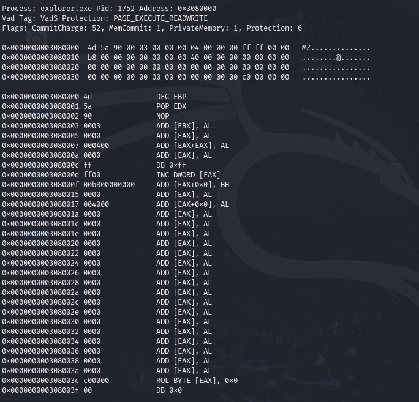
We can see that this process has MZ header witch mean The memory region marked as PAGE_EXECUTE_READWRITE indicated potential malicious activity. This is suspicious because it allows dynamic execution and modification.

We dumped the process using procdump and checked its hash on VirusTotal, which flagged it as malicious:

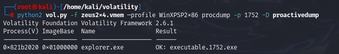
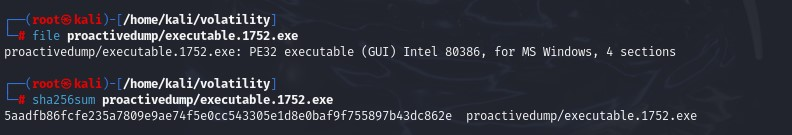
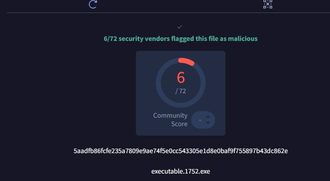
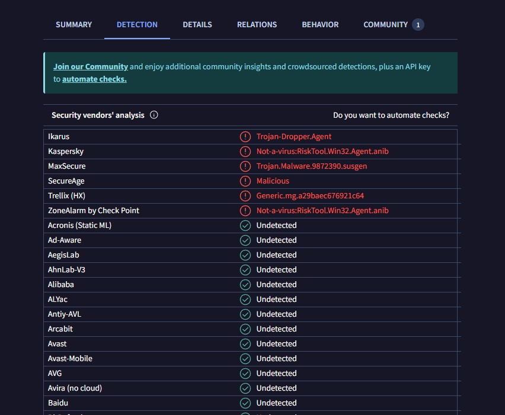
Let’s not stop here.
Let’s try dumping the region of memory where we think that the malicious code is injected and analyze it. For this we can use the vaddump plugin and provide the PID,

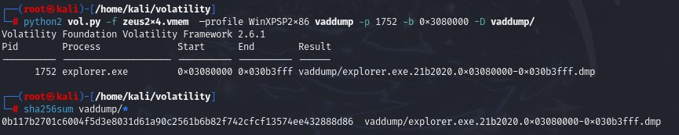
Then check the hash of the file then check it on VirusTotal
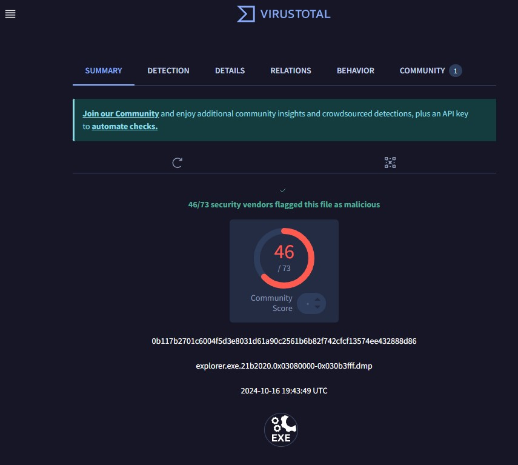
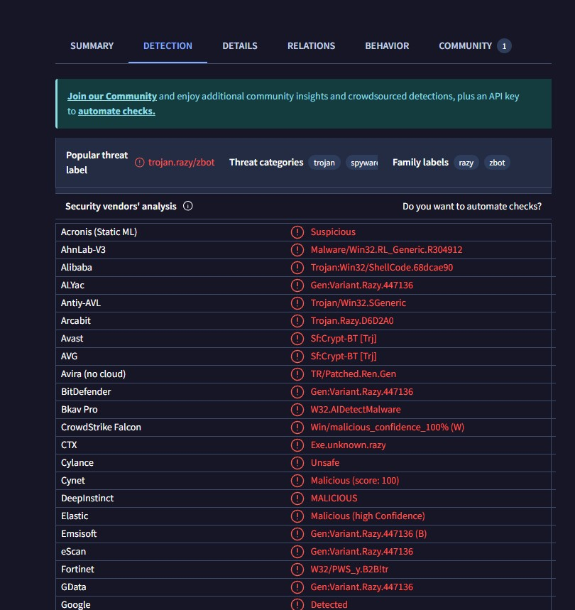
### Conclusion
The process explorer.exe (PID 1752) had malicious code injected into it and was contacting the flagged IP address 193.43.134.14.

## Yara

### Step 1: Extract Strings
We created a directory named proactive containing the Zeus malware and the memory dump. 
We use the strings tool to extract human readable strings from a binary file (invoice_2318362983713_823931342io.pdf.exe) and save them to a text file (zeus_strings.txt).

shell
strings invoice_2318362983713_823931342io.pdf.exe > zeus_strings.txt

We got the domains using the grep tool:

shell
grep -E '\b[a-zA-Z0-9.-]+\.[a-zA-Z]{2,6}\b' zeus_strings.txt > patterns.txt

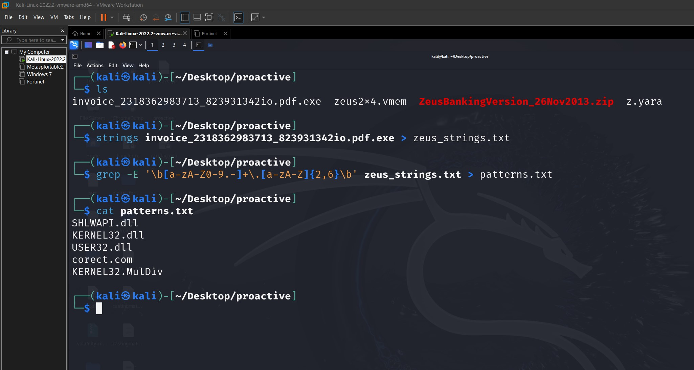

### Step 2: Analyze Patterns
We identified:
- DLLs: SHLWAPI.dll, KERNEL32.dll, USER32.dll
- Domain: corect.com
- API: KERNEL32.MulDiv

We use Hxd to try to manually identify patterns in the binaries and as we can see we found th MZ as the first 2 bytes which indicates that this is an executable file.

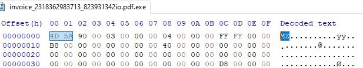

We get the hex of all the dlls, domains and API calls we found 

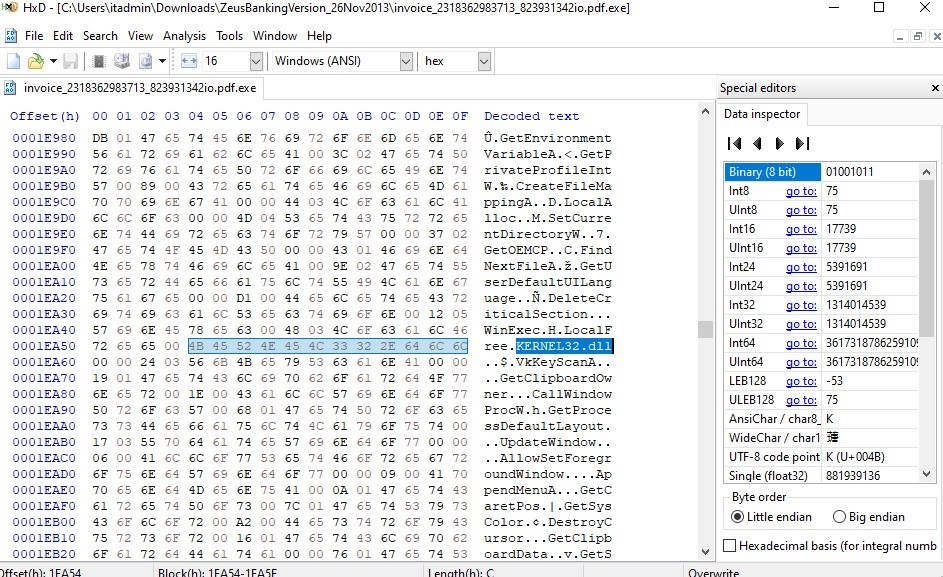

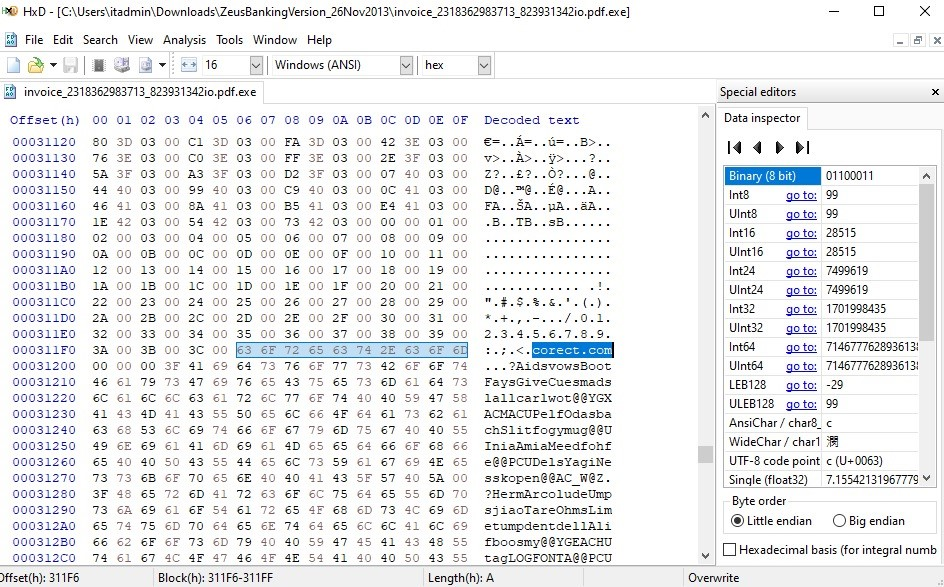
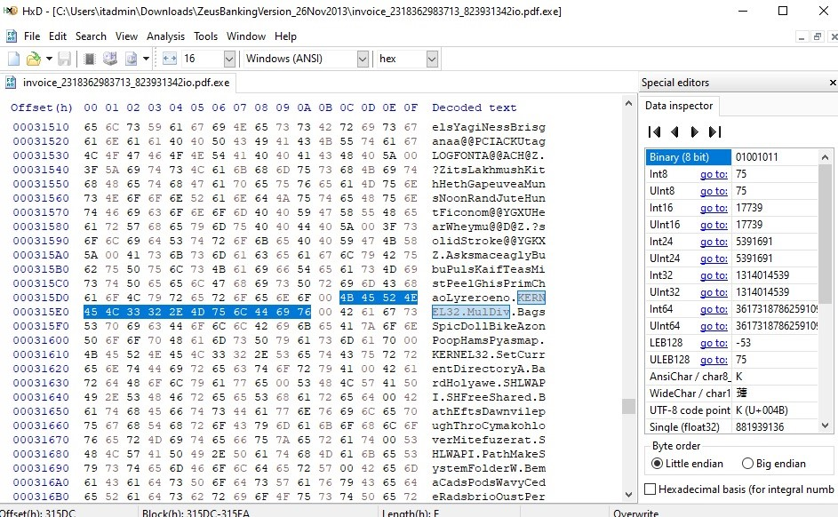

### Step 3: Create YARA Rule
We created the following YARA rule:

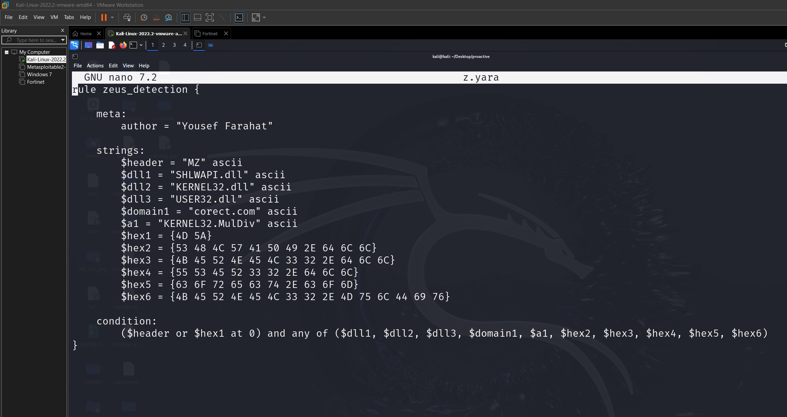

A full version of the YARA rules can be found in the repository: [YARA Rules File](rules/zeus-malware.yara).

### Step 4: Test YARA Rule
We tested the YARA rule on the malware file and memory dump, which were successfully detected:

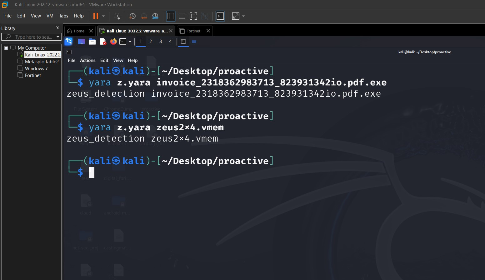
---
