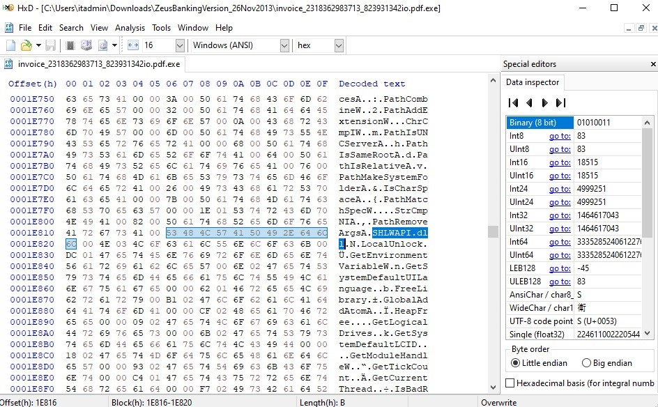
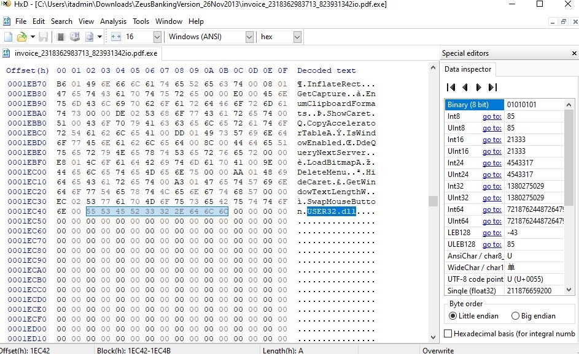

# project-proactive-team-18
Detect and analyze the Zeus Banking Trojan using various tools and techniques, including malware simulation, network monitoring, memory analysis, and signature-based detection.

# Proactive Security Final Project

*Team 18*

| Name                     | ID           | role         |
|--------------------------|--------------|------------- |
| Yousef Ahmed Ebrahim Farahat | 20201377622 | Yara      |
| Youssef George Abdou     | 2106148      | Volatilty    |
| Abd El Rahman Raslan     | 20221460102  | Splunk       |
| Ahmed Yasser Battour     | 2106135      | Suricata     |

---

## Contents
1. [Suricata](#suricata)
2. [splunk](#Splunk)
3. [Analyze Memory with Volatility](#analyze-memory-with-volatility)
4. [Yara](#yara)

---

---

## Suricata

First, I created a file called custom-new.rules and added these rules for Suricata running on Windows:

shell
alert ip any any -> 85.114.128.127 any (msg:"Blocked Trojan Communication to IP 192.168.1.124"; sid:100001; rev:1; classtype:trojan-activity; priority:1;)
alert dns any any -> any any (msg:"Blocked DNS query for fpdownload.macromedia.com (Trojan IOC)"; content:"fpdownload.macromedia.com"; nocase; sid:100002; rev:1; classtype:trojan-activity; priority:1;)
alert dns any any -> any any (msg:"Blocked DNS response for Trojan domain resolving to IP 192.168.1.124"; content:"192.168.1.124"; sid:100003; rev:1; classtype:trojan-activity; priority:1;)

Then, I added this file to the rules folder. Next, I edited the yaml file and included custom-new.rules. Finally, I tested Suricata using:

shell
suricata.exe -T -c "C:\Program Files\Suricata\suricata.yaml"

No errors were found, and I started Suricata to monitor.

---

## Analyze Memory with Volatility

### Step 1: Identify Profile
We downloaded a memory dump and identified the profile using the imageinfo plugin:

We selected "WinXPSP2x86" from the suggested profiles and continued.

### Step 2: List Processes
We listed processes using the psscan plugin:

We don’t see anything suspicious from the processes listed

### Step 3: Parent-Child Relationships
We examined parent-child relationships using the pstree plugin:

Still, nothing suspicious was found. The names of the processes, their count, and their relationships all appeared legitimate.

### Step 4: Network Connections
Now we will go for looking for suspicious activities is the network connections
There are open connection shown by connections plugin with PID 1752,

shows that there are connections made by the PID 1752 by connscan plugin

We checked the reputation of IP 193.43.134.14 on VirusTotal, which flagged it as suspicious:

### Step 5: Investigate Processes
Now let’s see which process was communicating with this IP address by grepping the output of psscan.

(images)

We can see that the process that made the suspicious network connection is “explorer.exe” of PID 1752

Using the cmdline plugin, we confirmed the process path appeared legitimate:

Till now nothing about the process looks suspicious.
Maybe the code is injected into this process.
To investigate this, let’s use malfind plugin.

We can see that this process has MZ header witch mean The memory region marked as PAGE_EXECUTE_READWRITE indicated potential malicious activity. This is suspicious because it allows dynamic execution and modification.

We dumped the process using procdump and checked its hash on VirusTotal, which flagged it as malicious:

Let’s not stop here.
Let’s try dumping the region of memory where we think that the malicious code is injected and analyze it. For this we can use the vaddump plugin and provide the PID,

Then check the hash of the file then check it on VirusTotal

### Conclusion
The process explorer.exe (PID 1752) had malicious code injected into it and was contacting the flagged IP address 193.43.134.14.

## Yara

### Step 1: Extract Strings
We created a directory named proactive containing the Zeus malware and the memory dump. 
We use the strings tool to extract human readable strings from a binary file (invoice_2318362983713_823931342io.pdf.exe) and save them to a text file (zeus_strings.txt).

shell
strings invoice_2318362983713_823931342io.pdf.exe > zeus_strings.txt

We got the domains using the grep tool:

shell
grep -E '\b[a-zA-Z0-9.-]+\.[a-zA-Z]{2,6}\b' zeus_strings.txt > patterns.txt

### Step 2: Analyze Patterns
We identified:
- DLLs: SHLWAPI.dll, KERNEL32.dll, USER32.dll
- Domain: corect.com
- API: KERNEL32.MulDiv

We use Hxd to try to manually identify patterns in the binaries and as we can see we found th MZ as the first 2 bytes which indicates that this is an executable file.

We get the hex of all the dlls, domains and API calls we found 

### Step 3: Create YARA Rule
We created the following YARA rule:

A full version of the YARA rules can be found in the repository: [YARA Rules File](rules/zeus-malware.yara).

### Step 4: Test YARA Rule
We tested the YARA rule on the malware file and memory dump, which were successfully detected:

---
